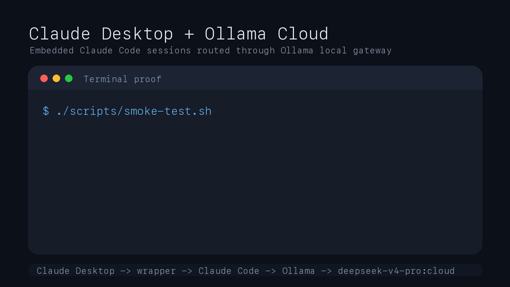
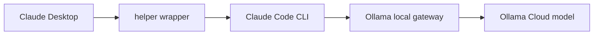

# Claude Desktop + Ollama Cloud

Run Ollama Cloud models inside Claude Desktop's embedded Claude Code sessions on macOS.

[](#tested-on)
[](#what-this-does)
[](#important-scope)
[](https://github.com/FernellysM/claude-desktop-ollama-cloud/releases/latest)
[](LICENSE)



Claude Desktop does not currently expose a normal setting to swap its built-in Claude model for an Ollama Cloud model. This workaround routes Claude Desktop's embedded Claude Code / local code sessions through Ollama's Anthropic-compatible local gateway.

It turns this:

```text
Claude Desktop local code session -> Claude Code -> Anthropic default model
```

into this:

```text
Claude Desktop local code session -> wrapper -> Claude Code -> Ollama -> deepseek-v4-pro:cloud
```

## The 30 Second Version

```sh
ollama signin
ollama list | grep ':cloud'

security add-generic-password \
  -a "$USER" \
  -s "ollama-cloud-api-key" \
  -w "PASTE_YOUR_OLLAMA_API_KEY_HERE" \
  -U

./scripts/install.sh
./scripts/smoke-test.sh
```

Then open Claude Desktop, start a Claude Code / local code session, and watch:

```sh
tail -f /tmp/claude-desktop-ollama-wrapper.log
```

If the log says `routed Claude Code launch to ...:cloud`, the route is working.

## Important Scope

This does not replace the normal Claude chat model in Claude Desktop.

It targets the Claude Code / local agent sessions that Claude Desktop launches internally. Those sessions can edit files, run tools, and work in local code folders.

## Tested On

- macOS on Apple Silicon
- Claude Desktop `1.6608.0`
- Claude Code CLI `2.1.140`
- Ollama `0.21.2`
- Ollama Cloud model `deepseek-v4-pro:cloud`

This is an unsupported workaround. Claude Desktop and Ollama change quickly, and a Claude Desktop update may overwrite the helper or change the launch path.

## Why This Is Useful

- Try Ollama Cloud models inside a familiar Claude Desktop code workflow.
- Use models like `deepseek-v4-pro:cloud`, `kimi-k2.6:cloud`, `glm-5.1:cloud`, or `qwen3.5:397b-cloud`.
- Keep the API key out of plaintext files by storing it in macOS Keychain.
- Restore normal Claude Desktop behavior with one command.

## How It Works

Claude Desktop launches a helper named:

```text
/Applications/Claude.app/Contents/Helpers/disclaimer
```

The installer preserves the original helper as:

```text
/Applications/Claude.app/Contents/Helpers/disclaimer.real
```

Then it installs a small Bash wrapper at the original path. When Claude Desktop starts an embedded Claude Code session, the wrapper:

1. Reads your Ollama API key from macOS Keychain.
2. Sets `ANTHROPIC_BASE_URL=http://127.0.0.1:11434`.
3. Rewrites Claude model arguments such as `claude-sonnet-4-6` to your selected Ollama Cloud model.
4. Launches the host Claude Code CLI.
5. Logs the route to `/tmp/claude-desktop-ollama-wrapper.log`.



## Prerequisites

Install Ollama and sign in:

```sh
ollama signin
ollama --version
```

Confirm cloud models are available:

```sh
ollama list | grep ':cloud'
```

Confirm Claude Code is installed:

```sh
"$HOME/.local/bin/claude" --version
```

If needed:

```sh
curl -fsSL https://claude.ai/install.sh | bash
```

Save your Ollama API key in Keychain:

```sh
security add-generic-password \
  -a "$USER" \
  -s "ollama-cloud-api-key" \
  -w "PASTE_YOUR_OLLAMA_API_KEY_HERE" \
  -U
```

Do not commit or paste your real API key.

## Install

```sh
./scripts/install.sh
```

The installer defaults to the first Claude model listed in:

```text
~/.ollama/config.json
```

If no model is found there, it falls back to:

```text
deepseek-v4-pro:cloud
```

Override the model at install or launch time:

```sh
OLLAMA_CLAUDE_MODEL="kimi-k2.6:cloud" ./scripts/install.sh
```

## Test

Run the terminal smoke test:

```sh
./scripts/smoke-test.sh
```

Expected output:

```text
ok
```

Then open Claude Desktop and start a Claude Code / local code session. Ask:

```text
What model are you running? Then create /tmp/ollama_desktop_test.txt with "hello from ollama desktop" and read it back.
```

Verify:

```sh
cat /tmp/ollama_desktop_test.txt
tail -3 /tmp/claude-desktop-ollama-wrapper.log
```

The wrapper log is the reliable proof. A model may not always self-report accurately.

## Switch Models

Edit the Claude integration model in Ollama's config:

```sh
jq '.integrations.claude.models = ["glm-5.1:cloud"]' \
  "$HOME/.ollama/config.json" > /tmp/ollama-config.json \
  && mv /tmp/ollama-config.json "$HOME/.ollama/config.json"
```

Or override per launch:

```sh
OLLAMA_CLAUDE_MODEL="qwen3.5:397b-cloud" open -a Claude
```

## Restore

```sh
./scripts/restore.sh
```

This moves `disclaimer.real` back to `disclaimer` and restores normal Claude Desktop behavior.

## Troubleshooting

No wrapper log:

```sh
tail -f /tmp/claude-desktop-ollama-wrapper.log
```

Then start a Claude Desktop local code session.

No cloud models:

```sh
ollama signin
ollama list | grep ':cloud'
```

Authentication fails:

```sh
security find-generic-password -a "$USER" -s "ollama-cloud-api-key" >/dev/null && echo ok
```

Claude Desktop update broke it:

```sh
./scripts/install.sh
```

Need to undo everything:

```sh
./scripts/restore.sh
```

## Security

- Store the Ollama API key in Keychain.
- Do not paste the key into chat, shell history, screenshots, or GitHub.
- Rotate the key if it was exposed anywhere.
- This modifies the Claude Desktop app bundle. Keep the restore script nearby.

## Related

The original tutorial gist is here:

https://gist.github.com/FernellysM/2ce62ea017ae9d78d7b2c54603e718c6

## License

MIT
